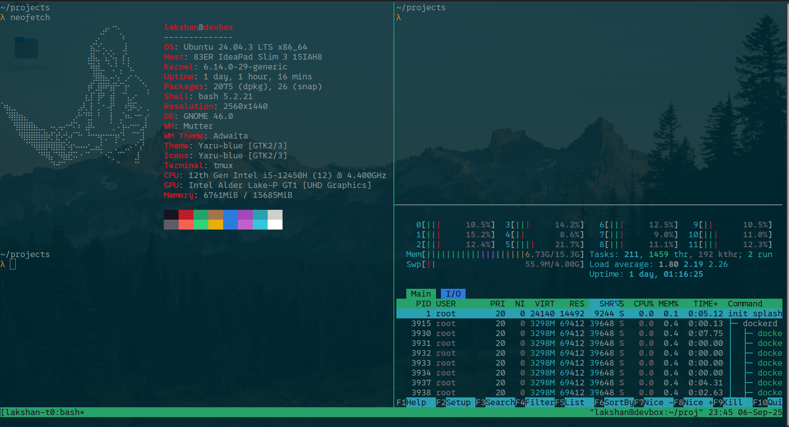

## 🌵 My IDE, Git, Shell & Other Dev Tool Configs

Here’s a screenshot of how this tmux setup looks:
<p align='left'>

</p>

To activate the setup run:
```
git clone https://github.com/0xlakshan/system-config.git
cd system-config
sh ./linux/terminal.sh
```

The custom ```.tmux.conf``` includes mouse support, allowing you to select and copy text using your mouse. It also integrates with the system clipboard via ```xclip```, making it easy to copy content between ```tmux``` and other applications. To ensure this functionality works properly, make sure the required packages ```tmux```, vim, and xclip are installed on your system.


